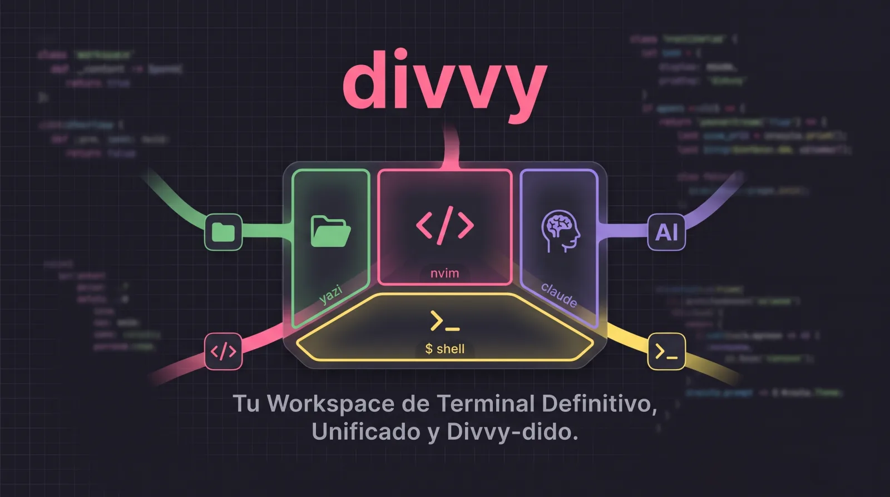

<div align="center">



**una terminal dividida para repartir** — archivos · editor · agente IA · shell

[English](README.md) · **Español**


</div>

Una terminal dividida estilo *tmux/omarchy* sobre **zellij**: explorador de archivos a la
izquierda, editor en el centro, agente de IA a la derecha y una terminal abajo — todo con
tema Dracula (y 4 temas más intercambiables). Corre **dentro de cualquier terminal true-color**
y puede instalar + auto-tematizar una por ti (Ghostty, WezTerm, kitty, Alacritty).

```
┌──────────────────────── tab-bar ────────────────────────┐
│   archivos    │      editor        │      agente         │
│   (yazi)      │   (nvim/helix/…)   │  (claude/agy/…)     │
├───────────────┴────────────────────┴─────────────────────┤
│   terminal                                                │
├──────────────────────── status-bar ─────────────────────┤
```

Al pulsar **Enter** sobre un archivo en yazi, se abre en el editor del centro y el foco salta
solo a ese panel.

---

## Requisitos

| Herramienta | Rol | Obligatorio |
|---|---|---|
| [zellij](https://zellij.dev) | Multiplexor (divide la pantalla) | ✅ |
| [yazi](https://yazi-rs.github.io) | Explorador de archivos (panel izquierdo) | ✅ |
| nvim / helix / micro / vim | Editor (panel central) | al menos uno |
| un agente de IA (CLI) | Panel derecho — ver [Agentes](#agentes) | al menos uno |
| Una terminal true-color | Ver [Terminales](#terminales) — instala/tematiza opcional | recomendado |
| JetBrainsMono Nerd Font | Iconos en yazi/lualine | **manual** ([cómo](#nerd-font-manual)) |

> **Terminal:** divvy corre dentro de zellij, así que funciona en **cualquier** terminal — pero
> para que los temas se vean fieles necesitas *true color*. Apple Terminal solo da 256 colores.
> divvy puede instalar y auto-tematizar **Ghostty / WezTerm / kitty / Alacritty** por ti (ver
> [Terminales](#terminales)).

---

## Instalación

```sh
git clone https://github.com/jairyara/divvy ~/divvy
cd ~/divvy
./install.sh          # guiado: eliges qué instalar (no todo)
```

El instalador es **interactivo**: el core (zellij + yazi) es obligatorio, y eliges **editores**,
**terminales** y **agentes** con menús de casillas (**espacio** marca, **↑/↓** mueve, **Enter**
confirma). Detecta lo ya instalado y lo salta. La **Nerd Font es un paso manual** — el
instalador te indica cómo al final (ver [Nerd Font](#nerd-font-manual)).

Prueba primero tu gestor de paquetes — **brew** (macOS/Linux), **apt**, **dnf**, **pacman**,
**zypper** o **apk**. Si una herramienta no está empaquetada para tu sistema, descarga el
binario oficial a `~/.local/bin`, así nunca instalas nada a mano.

**Sin preguntas (flags):**

```sh
./install.sh --minimal                 # core + nvim, nada más
./install.sh --all                     # todo
./install.sh --editors "helix nvim" --terminals "ghostty kitty" --agents "codex" --yes
./install.sh --dry-run                 # muestra qué haría, sin instalar
BINDIR=/usr/local/bin ./install.sh     # cambia dónde van los symlinks
```

| Flag | Qué hace |
|---|---|
| `--minimal` | solo core + nvim |
| `--all` | editores, todas las terminales y agentes |
| `--editors "..."` | lista de editores (nvim helix micro vim) |
| `--terminals "..."` | terminales a instalar/tematizar (ghostty wezterm kitty alacritty) |
| `--agents "..."` | agentes a instalar (codex opencode aider goose agy) |
| `--yes` | sin confirmación · `--dry-run` simula |

---

## Uso

```sh
divvy                              # nvim + claude (por defecto)
divvy -e helix -a agy             # helix + antigravity
divvy --editor micro --agent claude
divvy --theme nord                 # cambia tema y lanza
divvy --list                       # ver editores, agentes y temas
divvy --help
```

> **nvim es el editor por defecto**: corre como servidor, así cada archivo que abres desde
> yazi se acumula como **pestaña** (bufferline). Trae LSP y no choca con zellij (`:w` guardar,
> `:q` cerrar). helix/micro/vim abren un archivo a la vez (sin socket) → `-e helix`.

### Flags

| Flag | Valores | Def. |
|---|---|---|
| `-e`, `--editor` | `nvim` · `helix` · `micro` · `vim` | `nvim` |
| `-a`, `--agent`  | cualquier comando (ver [Agentes](#agentes)) | `claude` |
| `-t`, `--theme`  | `dracula` · `catppuccin` · `tokyonight` · `gruvbox` · `nord` | — |
| `--dry-run` | genera el layout y lo imprime (no lanza) | |
| `-l`, `--list` / `-h`, `--help` | | |

---

## Temas

Cambian **todo el stack a la vez** (zellij + ghostty + helix + micro + nvim):

```sh
divvy-theme nord          # solo cambia el tema
divvy --theme nord        # cambia y lanza
```

Temas: `dracula` · `catppuccin` · `tokyonight` · `gruvbox` · `nord`.

> Tras cambiar de tema: **relanza divvy** (zellij/editores). Las terminales también se
> actualizan: **Ghostty** `Cmd+Shift+R` · **WezTerm / kitty / Alacritty** recargan solas.

---

## Terminales

divvy corre **dentro de zellij**, así que funciona en **cualquier** terminal true-color — no
tienes que instalar una nueva. Si quieres, el instalador puede configurar una y `divvy-theme`
la mantendrá sincronizada con el resto del stack:

| Terminal | Auto-instala | Auto-tema | Notas |
|---|---|---|---|
| [Ghostty](https://ghostty.org) | ✅ | ✅ | Recomendada. Temas built-in; recarga con `Cmd+Shift+R`. |
| [WezTerm](https://wezterm.org) | ✅ | ✅ | Color schemes built-in; recarga en vivo. |
| [kitty](https://sw.kovidgoyal.net/kitty/) | ✅ | ✅ | Temas bundleados; recarga con `SIGUSR1`. |
| [Alacritty](https://alacritty.org) | ✅ | ✅ | Temas bundleados; recarga de config en vivo. |
| cualquier otra | — | — | Funciona igual; solo no se auto-tematiza. |

> divvy **nunca sobrescribe** una config de terminal existente — solo escribe una config inicial
> cuando no hay ninguna, y `divvy-theme` reescribe únicamente la línea/archivo del tema.

```sh
./install.sh --terminals "ghostty wezterm kitty alacritty"
```

---

## Nerd Font (manual)

Los iconos en yazi y la barra de estado necesitan una **Nerd Font**. Instálala tú mismo (las
configs de terminal de divvy ya apuntan a `JetBrainsMono Nerd Font`):

```sh
# macOS
brew install --cask font-jetbrains-mono-nerd-font

# Linux — descarga + instala a mano
curl -fLO https://github.com/ryanoasis/nerd-fonts/releases/latest/download/JetBrainsMono.zip
unzip JetBrainsMono.zip -d ~/.local/share/fonts && fc-cache -f
```

Luego selecciona **JetBrainsMono Nerd Font** en la config de fuente de tu terminal. Sin ella,
los iconos se ven como cuadritos (todo lo demás sigue funcionando).

---

## Agentes

El panel derecho corre **cualquier comando** que le pases con `-a`, así que usas el agente que
prefieras (y el que pagues). Recomendados:

| Agente | `-a` | Instalar |
|---|---|---|
| Claude Code | `claude` | `npm i -g @anthropic-ai/claude-code` · `curl -fsSL https://claude.ai/install.sh \| sh` |
| OpenAI Codex | `codex` | `brew install --cask codex` · `npm i -g @openai/codex` |
| opencode | `opencode` | `brew install opencode` · `npm i -g opencode-ai` |
| aider | `aider` | `brew install aider` · `pipx install aider-chat` |
| goose | `goose` | `brew install block-goose-cli` |
| Antigravity | `agy` | `curl -fsSL https://antigravity.google/cli/install.sh \| sh` |

```sh
divvy -a codex          # OpenAI Codex
divvy -a agy            # Antigravity
divvy -a mi-agente      # cualquier comando tuyo
```

Si el comando no está instalado, divvy te avisa y el panel mostrará el error (no rompe el resto).

## Atajos (zellij)

| Acción | Tecla |
|---|---|
| Saltar a un panel concreto | `Alt` + `1` archivos · `2` editor · `3` agente · `4` terminal (recomendado) |
| Moverte entre paneles | `Alt` + flechas · `Alt` + `h/j/k/l` |
| Pantalla completa del panel | `Ctrl p` → `f` |
| Nueva pestaña | `Ctrl t` → `n` · cambiar: `Ctrl t` → flechas |
| Modo scroll (ver output viejo) | `Ctrl s` (sal con `Esc`) |
| Redimensionar panel | `Ctrl n` → flechas |
| Salir | `Ctrl q` |

En **yazi** (panel izquierdo): `↑/↓` navegar, `→` entrar, `←` subir, `Enter` abrir en el editor.

---

## Cómo funciona

| Script | Rol |
|---|---|
| `divvy` | Lee las flags → genera `.runtime/layout.kdl` → lanza zellij |
| `divvy-edit` | Corre el editor central |
| `divvy-open` | Lo que yazi llama al dar Enter (manda el archivo al editor) |
| `divvy-theme` | Cambia el tema en todas las herramientas |

**Integración yazi → editor:**
- **nvim**: arranca como servidor (`--listen`); yazi le envía archivos por socket → se abren
  como buffers, en vivo. *La más fluida.* Incluye **LSP** (autocompletado, ir-a-definición,
  diagnósticos vía mason) + treesitter + tema.
- **helix / micro / vim**: no tienen socket; yazi manda la ruta por una FIFO. Abres un
  archivo y lo editas; para abrir otro desde yazi, **cierra el actual** primero. (helix trae
  LSP built-in.)

Solo el **texto/código** va al editor; imágenes, PDF y video abren con la app del sistema.
Los sockets/FIFO se nombran por sesión de zellij, así que puedes tener **varios divvy a la
vez** sin que se pisen.

### Atajos en nvim (editor por defecto)

| Acción | Tecla |
|---|---|
| Pestaña siguiente / anterior | `Tab` / `Shift+Tab` |
| Cerrar pestaña | `:q` o `<leader>x` (leader = espacio) — **no** cierra nvim |
| Guardar y cerrar pestaña | `:wq` |
| Salir de nvim del todo | `:qa` (o `:q!` para forzar) |
| Ir a definición / referencias | `gd` / `gr` |
| Documentación | `K` |
| Renombrar / acción de código | `<leader>rn` / `<leader>ca` |
| Saltar entre errores | `[d` / `]d` |
| Autocompletado | `Ctrl-espacio` (acepta con `Ctrl-y`) |

Configs (todas dentro del proyecto, no ensucian tu `~/.config`):
`.config/nvim/init.lua` · `helix/config.toml` · `micro/settings.json` · `vim/vimrc` · `yazi/yazi.toml`.

---

## Portabilidad

| SO | Estado |
|---|---|
| macOS | ✅ |
| Linux | ✅ (cambian instalador y ruta de symlinks; el script se adapta solo) |
| Windows | ⚠️ solo vía **WSL2** (zellij/Ghostty no son nativos de Windows) |

---

## Problemas comunes

- **`divvy: command not found` (o una herramienta "installed but not on PATH"):** `~/.local/bin`
  aún no está en tu `PATH` en esta shell. El instalador agrega la línea a tu rc, así que funciona
  en terminales **nuevas**. Para activarlo en la actual, ejecuta `source ~/.zshrc` (o `~/.bashrc`),
  o agrega esta línea a tu config de shell a mano:
  ```sh
  export PATH="$HOME/.local/bin:$PATH"
  ```
- **Colores raros:** tu terminal no tiene true color → usa Ghostty/WezTerm/Alacritty.
- **`Alt`+flechas no mueven el foco:** en Apple Terminal activa "Usar Opción como Meta"; en
  Ghostty ya viene activado (`macos-option-as-alt`).
- **`Ctrl`+`1..4` no salta de panel:** la mayoría de terminales no mandan `Ctrl`+número de
  forma única (`Ctrl+2`=NUL, `Ctrl+3`=ESC…). Usa **`Alt`+`1..4`**, que sí es fiable.
- **Un archivo abierto desde yazi no aparece / yazi se "cuelga" al dar Enter:** era un prompt
  modal de nvim (swap o "Press ENTER") que congelaba el servidor. Ya está mitigado; si vuelve,
  ejecuta `divvy-clean` y relanza `divvy`.
- **Iconos como cuadros:** instala una Nerd Font y selecciónala en tu terminal.
- **El panel agente muestra error:** ese agente no está instalado (`opencode` no viene por
  defecto).
- **micro: `Ctrl+S`/`Ctrl+Q` no funcionan** (los captura zellij: search y quit). Antes de
  editar pulsa `Ctrl+g` (bloquea zellij → todas las teclas van a micro), guarda/cierra
  normal, y `Ctrl+g` otra vez para volver a navegar.

---

## Contributors

¡Gracias a quienes ayudan a mejorar divvy!

<a href="https://github.com/jairyara/divvy/graphs/contributors">
  
</a>

¿Quieres ayudar? Mira [CONTRIBUTING.md](CONTRIBUTING.md).

---

## Licencia

[MIT](LICENSE) © 2026 Jair Yara
